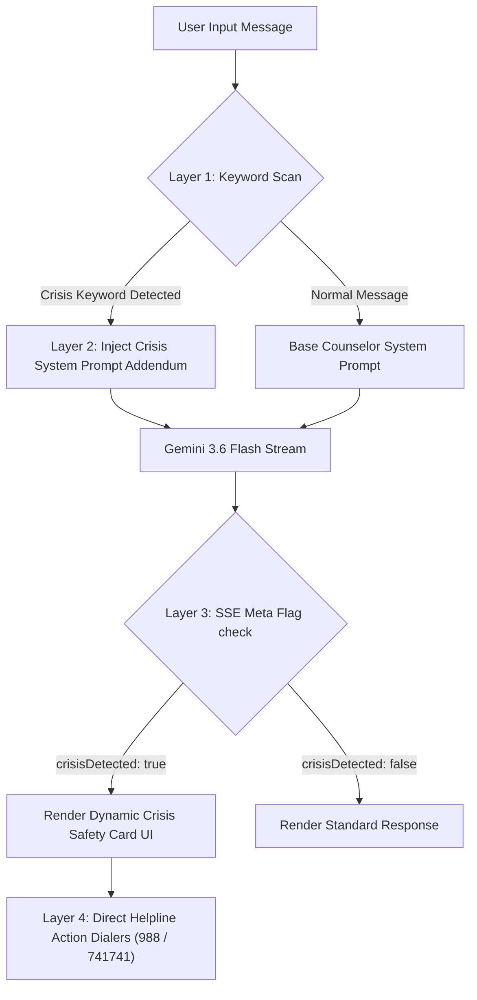

# Step-by-Step Prompt Guide to Recreate "Haven - AI Mental Health Counselor"

This document provides the exact sequence of prompts and architectural instructions required to build this project from scratch using an AI coding assistant (e.g., Antigravity, Gemini, ChatGPT, or Claude).

---

## Overview of the Architecture

- **Frontend:** React 19, Vite, Tailwind CSS v3, Framer Motion, Lucide Icons, React Router DOM v7
- **Backend:** Node.js Express 5, `@google/genai` (Gemini 3.6 Flash), Cors, Server-Sent Events (SSE)
- **Safety Engine:** Keyword Heuristics + System Prompt Addendum + Dynamic Helpline Card Injection
- **Wellness Tools:** Interactive Breathing Pacer, Daily Mood Log, Reflection Journal, Grounding Toolkit, Emergency Crisis Center

---

## 🛡️ Safety & Guardrails Architecture

Mental health applications require **multi-layered safety mechanisms** because AI models are conversational assistants—not clinical professionals or emergency responders. This project implements a 4-tier safety defense system:


### Safety Defense Layers:

1. **Layer 1: Real-Time Keyword Heuristics (`api/crisisConfig.js`)**
   - Conducts a fast, non-blocking scan on incoming user input against high-risk crisis terms (e.g., `"suicide"`, `"kill myself"`, `"want to die"`, `"hurt myself"`, `"can't take it anymore"`).
   - Serves as an immediate trigger mechanism for downstream safety actions.

2. **Layer 2: Dynamic System Prompt Addendum (`crisisSystemPromptAddendum`)**
   - When a crisis term is flagged, the server instantly appends strict safety guidelines to the AI system prompt:
     - **Empathy & Validation:** Lead with validation and care.
     - **Explicit AI Disclaimer:** Remind the user that the system is an AI and cannot guarantee safety in emergencies.
     - **Immediate Focus on Safety:** Direct the user to on-screen crisis resources and ask a direct safety check question (e.g., *"Are you safe right now?"*).
     - **No Problem-Solving / Diagnosis:** Prohibit the AI from probing deeper, offering clinical diagnosis, or attempting self-harm problem-solving.

3. **Layer 3: SSE Metadata UI Intercept & Crisis Card**
   - The API streams an initial SSE metadata event `data: {"type": "meta", "crisisDetected": true}`.
   - The React frontend catches this flag in real time and automatically renders a prominent, non-intrusive **Crisis Resource Card** directly above the conversation containing active contact buttons (988 Lifeline, Crisis Text Line 741741, Trevor Project).

4. **Layer 4: Persistent Header Banner & Clinical Disclaimers**
   - A sticky header banner displays 24/7 helpline access across all pages.
   - Clear disclaimers are placed on the landing page and chat interfaces stating that the AI is an educational tool and not a replacement for professional therapy or crisis intervention.

---

## Step-by-Step Prompts

### Step 1: Project Architecture & Package Setup
**Goal:** Initialize a React + Vite project with Tailwind CSS, Express backend, and `@google/genai`.

```text
Create a new React project using Vite and Node.js Express backend in a single workspace.
Set up the following tech stack:
- Frontend: React 19, Vite, Tailwind CSS v3, Framer Motion for animations, Lucide-React for icons, and React Router DOM v7.
- Backend: Express 5, Cors, Dotenv, and @google/genai SDK for Gemini 3.6 Flash streaming.
- Package Manager scripts:
  - "server": "node api/index.js"
  - "dev:frontend": "vite"
  - "dev": "concurrently \"npm run server\" \"npm run dev:frontend\""
- Vite Proxy: Proxy requests from `/api` to `http://localhost:3001`.
```

---

### Step 2: Crisis Heuristic & Safety Rules Engine
**Goal:** Create safety guardrails to detect distress/self-harm keywords and inject safety system prompts.

```text
Create `api/crisisConfig.js` containing:
1. `crisisResources`: Array of helpline info (988 Suicide & Crisis Lifeline, Crisis Text Line 741741, The Trevor Project).
2. `crisisKeywords`: Array of distress trigger words (e.g., "suicide", "kill myself", "want to die", "hurt myself", "can't take it anymore").
3. `getBaseSystemPrompt(aiName, aiTone)`: Function returning base prompt ("You are a mental health counselor named Haven...").
4. `crisisSystemPromptAddendum`: Safety instruction requiring the AI to validate feelings, state it is an AI, direct to crisis resources, and ask "Are you safe right now?" without giving medical/problem-solving advice.
```

---

### Step 3: Express Backend with Real-Time Streaming (SSE)
**Goal:** Build the Express backend server with Server-Sent Events (SSE) to stream Gemini response chunks to the frontend.

```text
Create `api/index.js` for Express running on port 3001:
1. Add `/api/health` and `/api/crisis-resources` GET endpoints.
2. Add `/api/chat` POST endpoint receiving `{ message, history, aiName, aiTone }`.
3. Check if the user message contains any crisis keywords.
4. Call `@google/genai` `ai.models.generateContentStream` with `gemini-3.6-flash`.
5. Stream response using Server-Sent Events (`text/event-stream`):
   - First event: `data: {"type": "meta", "crisisDetected": boolean}`
   - Token chunks: `data: {"type": "text", "text": "..."}`
   - End event: `data: {"type": "done"}`
```

---

### Step 4: UI Design System & Responsive Shell Layout
**Goal:** Build a soothing, modern glassmorphic theme with a responsive sidebar and main view container.

```text
Create a main layout shell with a collapsible sidebar and top header:
1. Styling: Soft pastel gradients (emerald, teal, indigo), rounded soft cards, glassmorphism, dark/light mode toggle.
2. Navigation links:
   - Chat Assistant (`/chat`)
   - Breathing Exercise (`/breathing`)
   - Mood Tracker (`/mood`)
   - Guided Journal (`/journal`)
   - Wellness Toolkit (`/toolkit`)
   - Emergency Help (`/help`)
   - Settings (`/settings`)
3. Quick Emergency Crisis Banner pinned to the top header for instant access to 988 Lifeline.
```

---

### Step 5: Real-Time Streaming Chat Interface & Crisis Banner
**Goal:** Build the main chat UI with streaming message bubbles, tone selector, and crisis alert modal/card.

```text
Create `src/components/ChatInterface.jsx`:
1. Support counselor customization (Name: Haven, Tone: Empathetic/Calm/Encouraging/Direct).
2. Fetch streaming responses using `fetchEventSource` or `ReadableStream` from `/api/chat`.
3. Animate incoming text tokens smoothly and display user vs AI chat bubbles with timestamps.
4. Crisis Safety Integration: If `crisisDetected` is true from SSE metadata, immediately display a prominent, non-intrusive Crisis Safety Card above the chat with direct clickable helpline phone buttons (988, 741741).
```

---

### Step 6: Mental Wellness Tools & Interactive Features
**Goal:** Create self-care interactive utilities for user mental health support.

```text
Create the following interactive wellness components:
1. `BreathingExercise.jsx`: Interactive visual breath pacer (Box Breathing 4-4-4-4 & 4-7-8 rhythm) with expanding/contracting animated circles using Framer Motion.
2. `MoodSelector.jsx`: Daily mood log (Great, Good, Okay, Down, Anxious) with emotion tag pickers and history tracker.
3. `JournalPage.jsx`: Daily reflection journal with therapeutic prompts ("What brought you peace today?", "What is on your mind?") and local storage saving.
4. `ToolkitPage.jsx`: Grounding 5-4-3-2-1 technique guide, mindfulness exercises, and calming sound generator.
5. `HelpPage.jsx`: Dedicated Emergency Crisis Resources page with one-touch phone dialers & crisis text services.
```

---

### Step 7: Landing Page & Testing Setup
**Goal:** Create an inviting homepage and automated unit tests.

```text
1. Create `LandingPage.jsx`: A hero page highlighting AI Counseling benefits, safety guardrails disclaimer ("Haven is an AI assistant, not a replacement for professional clinical care"), and a "Start Session" CTA button.
2. Set up Vitest tests in `src/components/__tests__/`:
   - Test rendering of ChatInterface message input.
   - Test Breathing exercise animation triggers.
   - Test Crisis Resource display logic.
```

---

## Summary Matrix

| Step | Output File / Component | Purpose |
| :--- | :--- | :--- |
| **1** | `package.json`, `vite.config.js` | Monorepo config & dependencies |
| **2** | `api/crisisConfig.js` | Safety keywords & crisis prompt addendum |
| **3** | `api/index.js` | Express API & SSE Gemini stream engine |
| **4** | `src/App.jsx`, `Layout.jsx` | Routing & Glassmorphic navigation |
| **5** | `ChatInterface.jsx` | Streaming chat UI & Crisis alert cards |
| **6** | `BreathingExercise.jsx`, `MoodSelector.jsx`, `JournalPage.jsx` | Self-care mental wellness tools |
| **7** | `LandingPage.jsx`, `__tests__` | Hero welcome & test suite |

---

## 💡 Essential Best Practices & Production Guidelines

When creating or maintaining a mental health AI application, strictly follow these core engineering and ethical best practices:

### 🔒 1. User Privacy & Data Ethics
- **No Third-Party Conversation Storage:** Do not send user chat history or private mental health entries to external analytics services.
- **Client-Side Storage Only:** Keep personal reflections, journal entries, and mood logs strictly in client-side `localStorage` or encrypted local storage.
- **API Key Isolation:** Keep your `GEMINI_API_KEY` strictly inside server environment variables (`.env`). **Never** expose API keys in frontend Vite code (`VITE_*` variables).

### 🤖 2. AI Prompt Engineering & Safety Standards
- **Strict Clinical Boundaries:** System prompts must explicitly state that the AI **cannot diagnose medical conditions** or prescribe treatments.
- **Immediate Emergency Pivot:** Whenever self-harm signals are detected, instruct the model to stop problem-solving and focus exclusively on validation, safety, and helpline referral.
- **Temperature & Tone Tuning:** Maintain a balanced temperature (e.g. `0.7`) to produce natural empathy while preventing wild ungrounded hallucinations.

### 📱 3. UX & Ergonomics for Distress Scenarios
- **One-Tap Dialing (`tel:` & `sms:` links):** Helpline numbers must be formatted as clickable HTML links (`tel:988`, `sms:741741`) so mobile users in crisis can reach help with a single tap.
- **Soothing Visual Design:** Avoid harsh red or alarming full-screen popups during crisis detection. Use soft, reassuring card alerts that inform without inducing panic.
- **Graceful Error Handling:** If the AI API stream drops or hits rate limits, provide a soft fallback message (e.g., *"I'm having a brief connection pause, but I'm still here. Remember crisis helplines are available anytime at 988."*).

### 🧪 4. Automated Safety Testing
- **Keyword Boundary Tests:** Maintain unit tests verifying that all `crisisKeywords` trigger the safety flag.
- **SSE Stream Contract Tests:** Test backend endpoints to ensure Server-Sent Events always output valid JSON format metadata chunks (`type: "meta"` and `type: "text"`).

